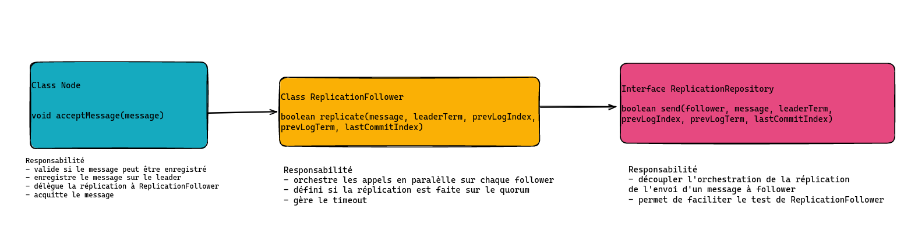

# Compte rendu de session RAFT 9

## Date

Date : 20/02/2023

## Participants

- Alexandre (LEAL)
- Borémi (BTO)
- Miranda (LIMI)
- Cédric (CEM)

## Objectifs de la session

### Définir si la réplication est reussi sur le quorum 

Jusqu'a maintenant, la réplication se faisait de manière séquentiel et était marqué en erreur dès qu'un follower n'arrivait pas à répliquer le message.
Le but de la session a été de : 
- définir si la réplication est reussi si le quorum est atteint.
- de mettre en place un mécanisme de réplication en parallèle.
## Réalisation

#### Ajout du concept de quorum

Le quorum est défini comme étant le nombre de noeud nécessaire pour atteindre la majorité des noeuds du cluster.
La réplication est considérée comme réussie si le message est répliqué au moins sur le quorum.
`ReplicationFollower` prend en compte la notion de quorum afin de définir si une réplication est réussie ou non.

#### Mise en place de la réplication en parallèle

`ReplicationFollower` est maintenant capable de répliquer un message en parallèle sur tous les noeuds du cluster.

#### Schéma d'archi

## Prochaine étape

- Faire en sorte que `ReplicationFollower` soit capable de renvoyer que la réplicaiton est en succès dès que le quorum est atteint
- Mettre en place des heartsbeats depuis le leader à intervalle régulier pour détecter les noeuds tombés
- Mettre en place un reset d'intervale de heartbeats en cas d'envoi de message de réplication